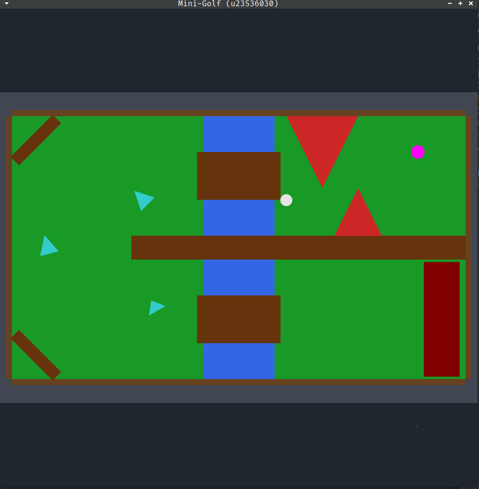
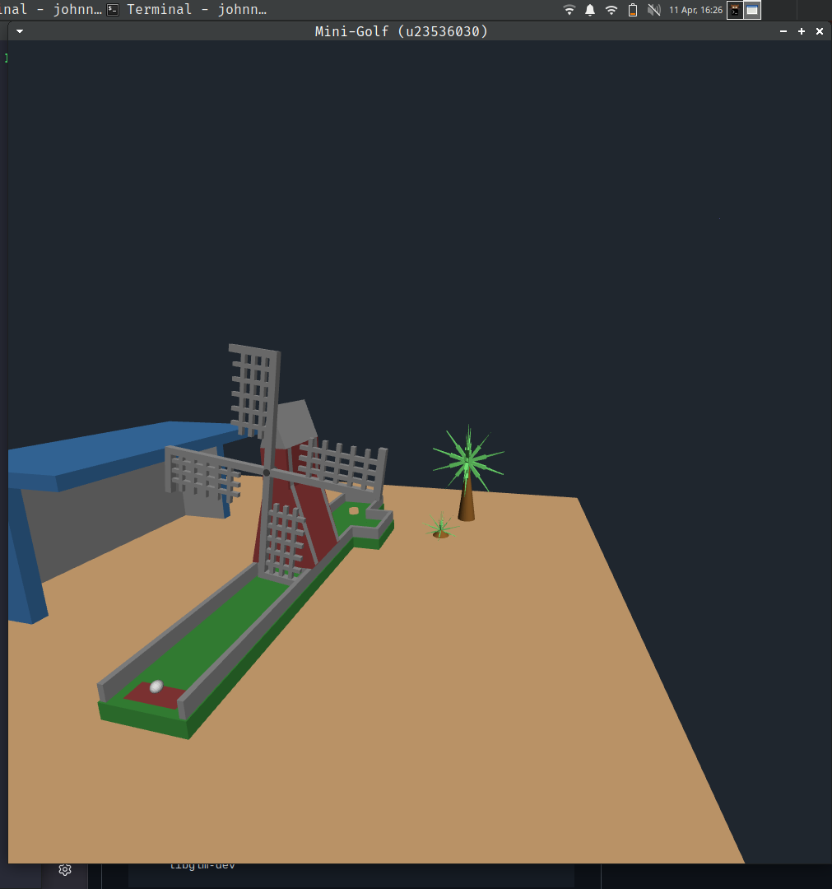

# COS344 – Computer Graphics Practicals

**Student:** u23536030  
**Course:** COS344 – Computer Graphics  
**University of Pretoria**

---

## Table of Contents

- [P2](#p2)
- [P3](#p3)
- [P4](#p4)

---

## P2

A 2D OpenGL scene editor supporting shape placement, transformation, selection, wireframe rendering, and scene persistence.



### Dependencies

Ensure the following are installed before building:

```bash
sudo apt update
sudo apt install -y \
    build-essential \
    cmake \
    libglfw3-dev \
    libglew-dev \
    libgl1-mesa-dev \
    libglu1-mesa-dev \
    libx11-dev \
    libxrandr-dev \
    libxinerama-dev \
    libxcursor-dev \
    libxi-dev \
    libglm-dev
```

### Quick Start (Submission Folder)

If you received a flat submission folder, a single script handles everything:

```bash
# 1. Navigate into the submission folder
cd submission/

# 2. Restore structure, build, and run — all in one command
./submission.sh makerun
```

### Manual Build (From Source)

If you have the full project structure:

```bash
# 1. Clone / extract the project, then navigate to the root
cd P2/

# 2. Create and enter the build directory
mkdir -p build && cd build

# 3. Configure with CMake
cmake ..

# 4. Build (uses all available cores)
make -j$(nproc)

# 5. Run
make run
# or directly:
./bin/MyOpenGLProject
```

### submission.sh Reference

The `submission.sh` script supports the following commands, all run from **inside** the submission folder:

| Command | Run from | Description |
|---|---|---|
| `./submission.sh create` | Project root | Flatten all files into `./submission/` |
| `./submission.sh makerun` | `submission/` | Restore structure → build → run |
| `./submission.sh clean` | `submission/` | Remove build artifacts (keeps save files) |

### Controls

| Key | Action |
|---|---|
| `1` | Select golf ball |
| `2` / `3` | Select obstacle |
| `4` | Select golf hole |
| `0` | Deselect obstacle |
| `W A S D` | Move selected object |
| `+` / `-` | Scale up / down |
| `Q` / `E` | Rotate CCW / CW |
| `Enter` | Toggle wireframe |
| `G` | Toggle debug grid |
| `P` | Pause / Resume |
| `R` | Restart scene |
| `↑` / `↓` | Increase / decrease FPS target |

### Troubleshooting

**`cmake` not found**
```bash
sudo apt install cmake
```

**GLFW / GLEW not found during CMake configure**
```bash
sudo apt install libglfw3-dev libglew-dev
```

**Linker errors with X11**
```bash
sudo apt install libx11-dev libxrandr-dev libxinerama-dev libxcursor-dev libxi-dev
```

**Program runs but window doesn't appear**  
Ensure you are running in a graphical environment (not a headless SSH session without X forwarding). If using SSH, enable X forwarding with `ssh -X`.

---

## P3

A 3D OpenGL scene, containing a windmill on a mini-golf course. Supports translations, rotations, drone movement, simple physics.


### Dependencies

Ensure the following are installed before building:

```bash
sudo apt update
sudo apt install -y \
    build-essential \
    cmake \
    libglfw3-dev \
    libglew-dev \
    libgl1-mesa-dev \
    libglu1-mesa-dev \
    libx11-dev \
    libxrandr-dev \
    libxinerama-dev \
    libxcursor-dev \
    libxi-dev \
    libglm-dev
```

### Quick Start (Submission Folder)

If you received a flat submission folder, a single script handles everything:

```bash
# 1. Navigate into the submission folder
cd submission/

# 2. Restore structure, build, and run — all in one command
./submission.sh makerun
```

### Manual Build (From Source)

If you have the full project structure:

```bash
# 1. Clone / extract the project, then navigate to the root
cd P3/

# 2. Create and enter the build directory
mkdir -p build && cd build

# 3. Configure with CMake
cmake .. -DCMAKE_BUILD_TYPE=Release -DENABLE_ASAN=OFF

# 4. Build (uses all available cores)
make -j$(nproc)

# 5. Run
make run
# or directly:
./bin/MyOpenGLProject
```

### submission.sh Reference

The `submission.sh` script supports the following commands, all run from **inside** the submission folder:

| Command | Run from | Description |
|---|---|---|
| `./submission.sh create` | Project root | Flatten all files into `./submission/` |
| `./submission.sh makerun` | `submission/` | Restore structure → build → run |
| `./submission.sh clean` | `submission/` | Remove build artifacts (keeps save files) |

### Controls

| Key | Action |
|---|---|
| `1` | Previous scene |
| `2` | Next scene |
| `3` | Nudge ball -x |
| `4` | Nudge ball +x |
| `5` | Nudge ball +z |
| `6` | Nudge ball -z |
| `7` | Toggle drone mode |
|`W/S`| Rotate scene X-axis |
|`A/D`| Rotate scene Y-axis |
|`Q/E`| Rotate scene Z-axis |
|`I/K`| Translate scene or Drone forward/back |
|`J/L`| Translate scene or Drone left/right |
|`U/O`| Translate scene or Drone up/down |
|`↑ / ↓`| Look up/down |
|`← / →`| Look left/right |
| `+` / `-` | Windmill blade speed |
| `Enter` | Toggle wireframe |
| `G` | Toggle debug grid |
| `P` | Pause / Resume |
| `R` | Restart scene |


### Troubleshooting

**`cmake` not found**
```bash
sudo apt install cmake
```

**GLFW / GLEW not found during CMake configure**
```bash
sudo apt install libglfw3-dev libglew-dev
```

**Linker errors with X11**
```bash
sudo apt install libx11-dev libxrandr-dev libxinerama-dev libxcursor-dev libxi-dev
```

**Program runs but window doesn't appear**  
Ensure you are running in a graphical environment (not a headless SSH session without X forwarding). If using SSH, enable X forwarding with `ssh -X`.

**Check includes**
```grep -rn "^#include" --include="*.cpp" --include="*.c" --include="*.hpp" --include="*.h" . \
  | grep -Ev '(stdio\.h|stdlib\.h|iostream|iomanip|initializer_list|cmath|sstream|GL/glew\.h|GLFW/glfw3\.h|glm/glm\.hpp|glm/gtc|glm/gtx|".*\.(h|hpp)")' \
  | grep -v "^Binary"
```
---


---

## P4

> _Coming soon._

---

*Last updated: 2026/04/11*
